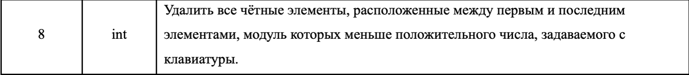

# Лабораторная работа № 4. Модификация одномерных динамических массивов.

- Размер динамического массива вводится пользователем на этапе выполнения.
- Тип массива указан в задании. Элементы массива вводятся с клавиатуры.
- Написать функции создания и заполнения массива, вывода массива, модификации массива указанных элементов.
- Вспомогательные массивы не использовать.
- Функция main должна содержать только объявление необходимых переменных и вызовы функций, указанных выше.

