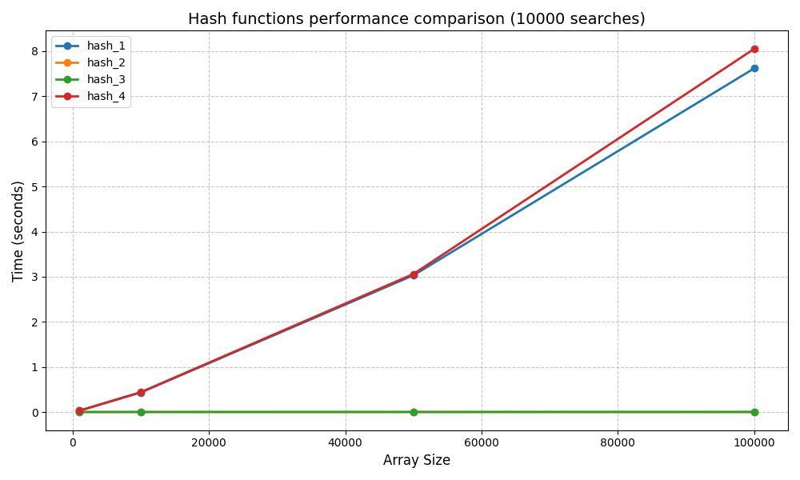
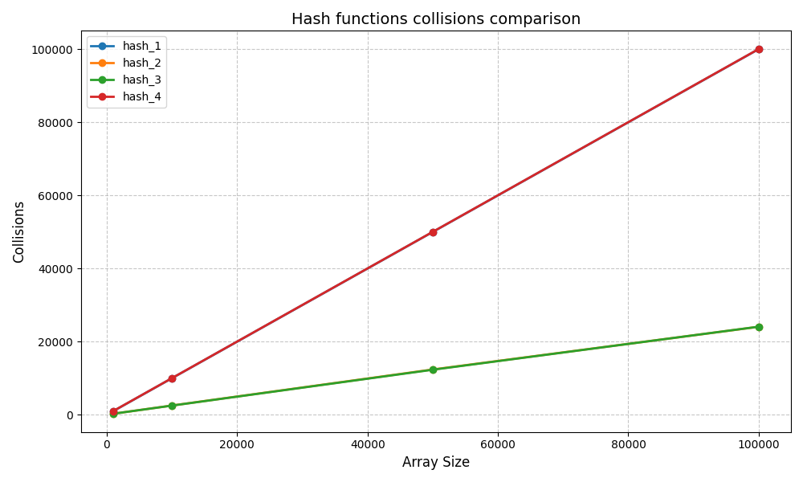

## Лабораторная работа №10. Хэширование.

1. Реализовать поиск заданного элемента (всех вхождений) в множестве объектов по ключу (в соответствии со структурой из  лабораторной работы 7, ключом так же является  первое НЕ числовое поле объекта) с помощью хэш таблицы с тремя разными хэш функциями (можно выбрать любые). Реализовать операции добавления и поиска элемента в хэш таблице.
2. Для хэш таблицы необходимо реализовать метод разрешения коллизий (любой). Подсчитать число коллизий хэш функции и построить график зависимости от размерности массива для каждой хэш функции. Предполагается, что размер хэш таблицы в два раза больше объема выборки. Полученные графики включить в отчет к работе.
3. Провести поиск с каждой хэш функцией для набора данных следующих размеров: 1000, 10000, 50000, 100000, 200000, 500000, 1000000. Засечь (программно) время поиска  и по полученным точкам построить графики зависимости времени поиска от размерности данных для каждого из функций на одной оси координат. Полученные графики включить в отчет к работе.

## Результаты

### Сравнение хорошей с плохими хэш функциями

### Сравнение хороших хэш функций

[link](https://docs.google.com/document/d/1CMXbEZi36OqvZEDVKdba2B6E8C84AGzry2jvDVYcILc/edit?tab=t.0)