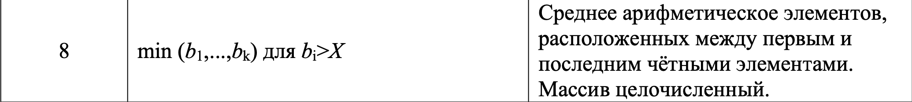

# Лабораторная работа №2
ОБРАБОТКА ДАННЫХ В ОДНОМЕРНОМ МАССИВЕ

Числовой массив B (тип массива указан в формулировке второго задания) содержит k
элементов. Элементы массива и пороговые значения X, Y вводятся с клавиатуры. Написать
подпрограммы создания массива и вывода его на экран. 

В первом задании требуется написать
функцию нахождения соответствующего варианту максимального/минимального значения, а
во втором – среднего арифметического указанных в условии элементов («между» понимать
строго – не включая найденные позиции).

Оба задания реализовать в одной программе.

