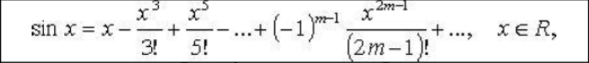

## Лабораторная работа №1.
ВЫЧИСЛЕНИЯ ПО РЕКУРРЕНТНЫМ ФОРМУЛАМ С ПОМОЩЬЮ ОПЕРАТОРОВ ЦИКЛА.
Вычислить приближенное значение функции, вычислив сумму конечного числа элементов ряда двумя способами, используя разные типы циклов: 

1) с заданной точностью (критерий остановки цикла – значение текущего члена ряда не превосходит точность);
2) для заданного количества членов ряда. 

Дополнительные требования:

Переход к способу вычисления реализовать на этапе выполнения с помощью условного оператора.

Проверять корректность введенных данных на этапе выполнения. В случае ввода пользователем некорректных данных (например, отрицательное число членов ряда) на этапе выполнения, возвращать его к повторному вводу, не завершая выполнение программы.

Не использовать математические функции (из math.h) для вычисления результата.

