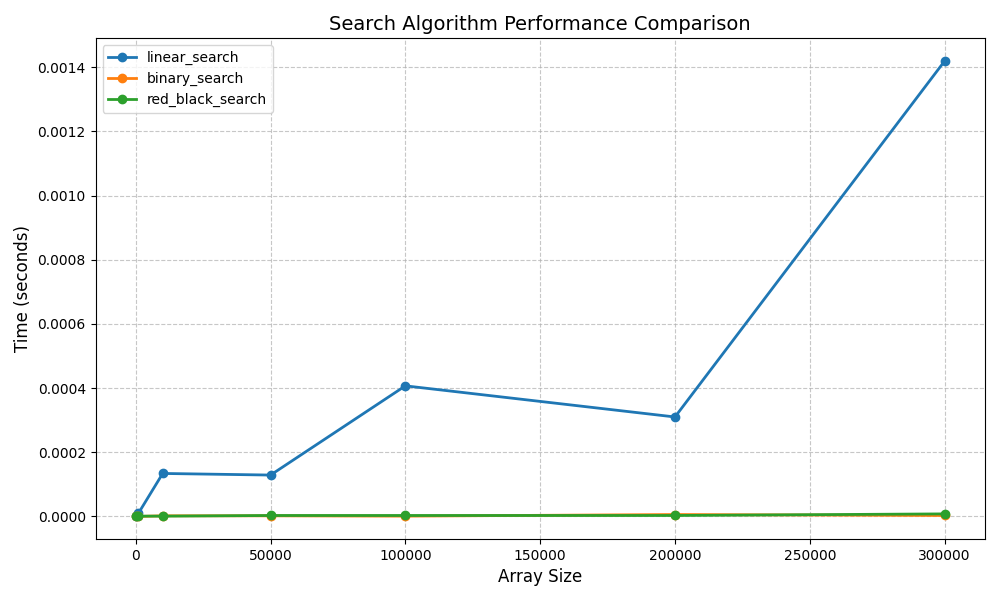
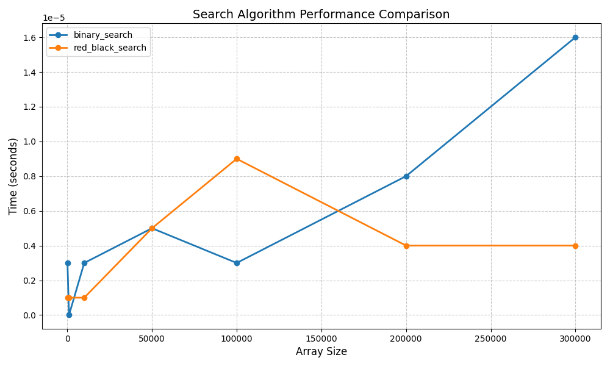

## Лабораторная работа №9. Алгоритмы и структуры поиска данных.

1. Реализовать поиск заданного элемента (первого вхождения) в множестве объектов по ключу (в соответствии со структурой
   из лабораторной работы 7, ключом так же является первое НЕ числовое поле объекта) следующими методами:

- линейный поиск (в массиве)
- с помощью бинарного дерева поиска
- с помощью красно-черного дерева.

### Для каждой структуры данных реализовать операции добавления и поиска элемента.

2. Реализовать автоматическую генерацию набора данных заданного размера. Выбор и запуск требуемого алгоритма
   осуществляется через меню на этапе выполнения.
3. Провести поиск каждым алгоритмом для набора данных следующих размеров: 100, 1000, 10000, 50000, 100000, 200000,
   300000\. Засечь (программно) время поиска каждым алгоритмом. По полученным точкам построить графики зависимости
   времени поиска от размерности данных для каждого из алгоритмов на одной оси координат. Полученные графики включить в
   отчет к работе.

## Результаты

[link](https://docs.google.com/document/d/1zz-OSMybNpbeRDmbUe23ZjUWaIxYF80ZIgBhTclus70/edit?tab=t.0)

