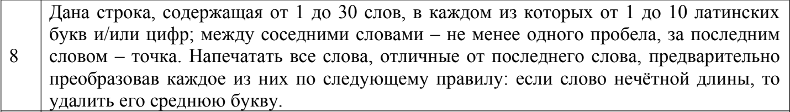

# Лабораторная работа № 5. ОБРАБОТКА СТРОК

- Написать функцию обработки строки и программу, тестирующую данную функцию. 
- В программе должен быть предусмотрен вывод исходной строки, которая при выделении слов не должна измениться.

