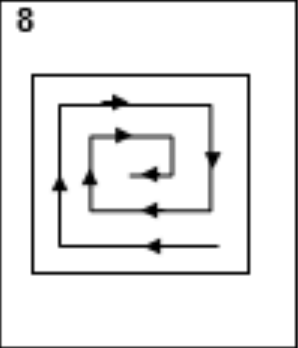

# Лабораторная работа № 3. Обработка двумерных массивов

Дана целочисленная квадратная матрица размера NxN, где 1 < N < 10. Фактический размер матрицы устанавливается до компиляции программы. Ввод элементов матрицы производится пользователем на этапе выполнения. Требуется последовательно вывести на стандартный поток вывода элементы в заданном порядке.

Программа должна быть разбита на несколько функций и обязательно содержать:
1) функцию формирования исходного массива;
2) функцию вывода исходного массива;
3) функцию последовательного вывода элементов матрицы в заданном порядке.

Все функции должны содержать список параметров, причём массив должен передаваться как параметр функции. 

Функция main должна содержать только операторы вызова функций.
Использовать статический массив. Дополнительных массивов не использовать!

